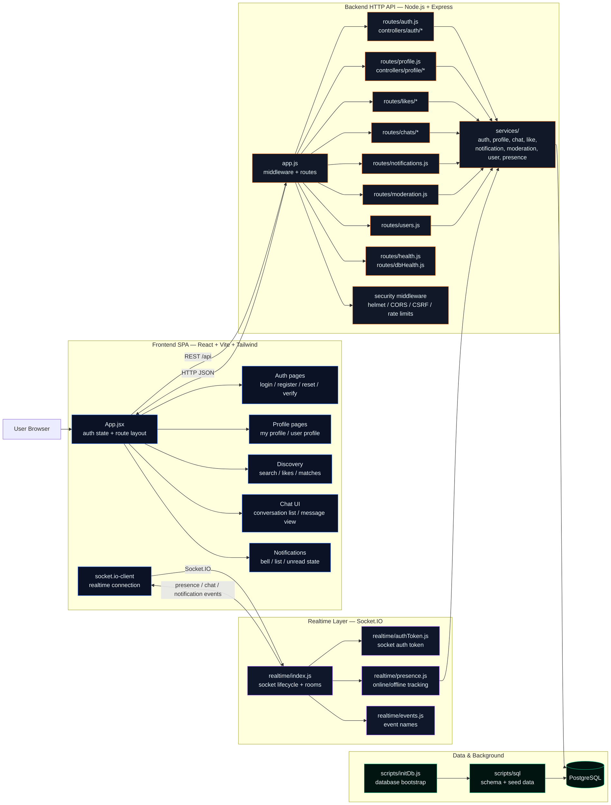

# Matcha Architecture and File Responsibility README

## 1) High-Level Architecture

Matcha is a full-stack web application with three runtime layers:

### Frontend SPA

- React + Vite + Tailwind
- Runs in browser
- Talks to backend through REST APIs and Socket.IO

### Backend API + Realtime Server

- Node.js + Express for HTTP APIs
- Socket.IO for realtime events (presence, chat, notifications)
- Main authentication pattern is `x-user-id` header plus realtime signed token for websockets

### Data Layer

- PostgreSQL for users, profiles, likes, views, chat, notifications, moderation, tags, photos

### Core Interaction Flow

1. Browser calls `/api` endpoints for CRUD
2. Backend validates input, writes/reads PostgreSQL
3. Backend emits realtime events via Socket.IO
4. Frontend listens and updates UI instantly

### Detailed Architecture Diagram

### How To Read It

- The frontend is split by user intent: authentication, profile management, discovery/matching, chat, and notifications.
- The HTTP API is where most business rules live. Each route module delegates into feature-specific controllers and shared services.
- The realtime layer is separate from REST. It handles socket auth, room membership, presence, and push-style updates for chat and notifications.
- PostgreSQL is the single source of truth for users, profiles, likes, messages, notifications, blocks, and moderation state.
- `scripts/initDb.js` and `scripts/sql/` define the schema and seed data used at bootstrap time.

---

## 2) Runtime Boot Sequence

### Backend Startup Order

1. `server.js` loads env and creates HTTP server
2. `app.js` mounts middleware and all API routes
3. `index.js` attaches Socket.IO to same server
4. `ensureChatVisibilityTables.js` ensures chat visibility tables exist
5. Server starts listening on configured port

### Frontend Startup Order

1. `main.jsx` mounts React app into root
2. `BrowserRouter` starts route handling
3. `App.jsx` manages auth state, route layout, and shared navigation
4. Notifications and chat realtime channels connect after login

---

## 3) Security and Validation Model

Implemented controls include:

- Helmet headers in `app.js`
- CORS allowlist from env
- CSRF origin/referer check in `csrfProtection.js`
- Global and auth-specific rate limiting in `rateLimit.js`
- Backend-side strict data validation for username, birth date, photo size/type, report reason length
- SQL parameterization using pg placeholders
- Frontend XSS helper utilities for text rendering
- Security static scan script: `securityPrecheck.js`

---

## 4) Realtime Event Model

### Server Event Constants

- `presence:update`
- `presence:ping`
- `notification:created`
- `profile:updated`
- `chat:message:created`
- `chat:message:deleted`
- `chat:conversation:read`
- `chat:block-status:changed`
- `chat:conversation:deleted`
- `chat:conversation:join`
- `chat:conversation:leave`
- `match:status:changed`

### Socket Auth

- Token created in `authToken.js`
- Verified in `index.js` during handshake
- User sockets join `user:{id}` room
- Conversation rooms joined/left for focused chat events

---

## 5) API Surface by Module

### Auth Routes

- Register, login
- Verify email, resend verification
- Request email change
- Forgot/reset password
- Realtime token endpoint
- Delete account

### Profile Routes

- Get my profile
- Get profile by user id
- Update profile
- Tag catalog endpoint
- Reverse geocoding
- Location validation
- City suggestions and neighborhoods

### Likes and Discovery Routes

- Who liked me
- Who viewed me
- Who matched me
- Record profile view
- Like/unlike user
- Match check endpoint
- Discovery endpoint with filters and sort

### Chats Routes

- List conversations
- List conversation messages with pagination
- Send message
- Mark conversation read
- Delete message (visibility delete)
- Delete conversation (visibility delete)
- Ensure conversation exists

### Notifications Routes

- List notifications
- Mark one as read
- Mark all as read

### Moderation Routes

- Report fake account
- Block/unblock user
- Get moderation status for target user
- List blocked users

### Health Routes

- `/health`
- `/db-health`

---

## 6) Database Initialization and Migration Strategy

`initDb.js` executes SQL in sequence:

1. Core tables
2. Social tables
3. Chat tables
4. Tags and seed data
5. Compatibility migration SQL for legacy user schema
6. Fake users seed
7. Photos support tables

### Important SQL Files Define Domain Boundaries

- users and auth
- profiles and profile tags
- likes and views
- notifications
- moderation (fake reports, blocks)
- chat conversations/messages
- media photos

---

## 7) Deployment and Environment Strategy

### Development Docker Mode

- `docker-compose.yml` mounts source volumes
- Backend uses nodemon through `docker-entrypoint.sh`
- Frontend uses Vite dev server
- DB runs as postgres container

### Backend Image

- `Dockerfile.backend`
- Entrypoint initializes DB and seed photos before starting dev server

### Frontend Image

- `frontend/Dockerfile`
- Exposes Vite dev service

### Makefile Wrappers

- `up` / `down` / `clean` / `fclean` / `re`

---

## 8) File-by-File Responsibility Map

> **Note:** This list covers project source, config, scripts, docs, and assets.  
> **Excluded:** `.git` internals, `node_modules`, build output directories.

### 8.1 Root Files

| File                          | Responsibility                                                                                              |
| ----------------------------- | ----------------------------------------------------------------------------------------------------------- |
| `app.js`                      | Express app assembly, middleware chain, CORS, CSRF, rate limits, route mounting, centralized error handling |
| `server.js`                   | HTTP server bootstrap, realtime init, startup sequence                                                      |
| `db.js`                       | PostgreSQL connection pool config                                                                           |
| `package.json`                | Backend dependencies and scripts                                                                            |
| `package-lock.json`           | Backend lockfile                                                                                            |
| `.env`                        | Local environment values                                                                                    |
| `.env.example`                | Template environment file                                                                                   |
| `.dockerignore`               | Backend docker ignore rules                                                                                 |
| `.gitignore`                  | Repository ignore rules                                                                                     |
| `docker-compose.yml`          | Multi-service dev stack (db, backend, frontend)                                                             |
| `Dockerfile.backend`          | Backend image definition                                                                                    |
| `docker-entrypoint.sh`        | Backend container startup logic (wait db, init db, seed photos, run dev)                                    |
| `Makefile`                    | Docker command shortcuts                                                                                    |
| `README.md`                   | Main project readme                                                                                         |
| `EMAIL_VERIFICATION_GUIDE.md` | Email verification workflow documentation                                                                   |
| `common_passwords.txt`        | Password strength blacklist source                                                                          |
| `Matcha-1.pdf`                | Project specification/reference document                                                                    |
| `matcha.pdf`                  | Project specification/reference document                                                                    |

### 8.2 Backend Middleware

| File                           | Responsibility                                    |
| ------------------------------ | ------------------------------------------------- |
| `middleware/csrfProtection.js` | Origin/referer validation for unsafe HTTP methods |
| `middleware/rateLimit.js`      | Global/auth/sensitive endpoint request throttling |

### 8.3 Backend Realtime Layer

| File                    | Responsibility                                               |
| ----------------------- | ------------------------------------------------------------ |
| `realtime/index.js`     | Socket.IO server lifecycle, auth middleware, room management |
| `realtime/events.js`    | Shared realtime event constant names                         |
| `realtime/authToken.js` | HMAC token creation and validation for websocket auth        |
| `realtime/presence.js`  | Online/offline socket tracking and presence broadcasts       |

### 8.4 Backend Route and Service Entry Points

| File                             | Responsibility                                                                                     |
| -------------------------------- | -------------------------------------------------------------------------------------------------- |
| `routes/health.js`               | Lightweight liveness endpoint                                                                      |
| `routes/dbHealth.js`             | DB connectivity check endpoint                                                                     |
| `routes/users.js`                | Basic CRUD user endpoints (legacy/simple utility)                                                  |
| `routes/auth.js`                 | Registration, login, email verification, email change, password reset, account deletion            |
| `routes/profile.js`              | Profile read/update, tags, location/geocode, city suggestion APIs                                  |
| `routes/likes/index.js`          | Entry router for likes, views, matches, and discovery; delegates to `routes/likes/*`              |
| `routes/chats/index.js`          | Entry router for conversations and messages; delegates to `routes/chats/*`                         |
| `routes/notifications.js`        | Read and read-state management for notifications                                                   |
| `controllers/notifications/index.js` | Notification read endpoints and read-state handlers                                             |
| `services/notificationService.js` | Notification creation helper and realtime push                                                     |
| `routes/moderation.js`           | Fake report submission, block lifecycle, moderation status APIs                                    |

### 8.5 Backend Utilities

| File                         | Responsibility                                                                         |
| ---------------------------- | -------------------------------------------------------------------------------------- |
| `utils/emailService.js`      | SMTP transport creation, verification/reset email senders, dev Ethereal fallback logic |
| `utils/photoValidator.js`    | Backend photo MIME/content/size checks and normalization                               |
| `utils/chatSystemMessage.js` | Helper to insert automatic system chat messages                                        |

### 8.6 Backend Scripts

| File                                                | Responsibility                                             |
| --------------------------------------------------- | ---------------------------------------------------------- |
| `scripts/initDb.js`                                 | Schema creation + migration + seed orchestration           |
| `scripts/ensureChatVisibilityTables.js`             | Creates missing chat visibility tables safely at runtime   |
| `scripts/seed_photos_for_existing_users.js`         | Random photo URL seeding for users                         |
| `scripts/checkBackendSyntax.js`                     | Syntax validation for backend JS files                     |
| `scripts/securityPrecheck.js`                       | Static checks for dangerous patterns (XSS/eval/unsafe SQL) |
| `scripts/debugRoutes.js`                            | Dumps app route stack for diagnostics                      |
| `scripts/dotenv_setup.js`                           | Environment loading helper                                 |
| `scripts/sql/create_users_table.sql`                | Users schema                                               |
| `scripts/sql/create_profiles_table.sql`             | Profiles schema                                            |
| `scripts/sql/create_likes_table.sql`                | Likes schema                                               |
| `scripts/sql/create_views_table.sql`                | Profile views schema                                       |
| `scripts/sql/create_tags_table.sql`                 | Tags catalog schema                                        |
| `scripts/sql/create_profile_tags_table.sql`         | Profile-to-tag join schema                                 |
| `scripts/sql/create_user_photos_table.sql`          | User photos schema                                         |
| `scripts/sql/create_notifications_table.sql`        | Notifications schema                                       |
| `scripts/sql/create_fake_account_reports_table.sql` | Fake report schema                                         |
| `scripts/sql/create_user_blocks_table.sql`          | User block schema                                          |
| `scripts/sql/create_chat_tables.sql`                | Chat conversation and messages schema                      |
| `scripts/sql/add_email_verification_columns.sql`    | Migration for verification fields                          |
| `scripts/sql/add_pending_email_columns.sql`         | Migration for pending email flow                           |
| `scripts/sql/add_password_reset_columns.sql`        | Migration for reset token fields                           |
| `scripts/sql/seed_default_tags.sql`                 | Default tag seed                                           |
| `scripts/sql/seed_fake_users.sql`                   | Demo/fake users seed                                       |

### 8.7 Frontend Root and Config

| File                           | Responsibility                                                   |
| ------------------------------ | ---------------------------------------------------------------- |
| `frontend/package.json`        | Frontend dependencies and scripts                                |
| `frontend/package-lock.json`   | Frontend lockfile                                                |
| `frontend/index.html`          | Root HTML shell                                                  |
| `frontend/vite.config.js`      | Vite config and API/socket proxy rules                           |
| `frontend/tailwind.config.cjs` | Tailwind theme extensions                                        |
| `frontend/postcss.config.cjs`  | PostCSS pipeline config                                          |
| `frontend/eslint.config.js`    | Lint rules (including XSS-oriented restrictions)                 |
| `frontend/Dockerfile`          | Frontend dev image                                               |
| `frontend/.dockerignore`       | Frontend docker ignore rules                                     |
| `frontend/.gitignore`          | Frontend local ignore rules                                      |
| `frontend/README.md`           | Template frontend readme from Vite                               |
| `frontend/typescript`          | Terminal transcript artifact file, not part of runtime app logic |

### 8.8 Frontend Public Assets

| File                          | Responsibility                |
| ----------------------------- | ----------------------------- |
| `frontend/public/favicon.svg` | Browser favicon               |
| `frontend/public/icons.svg`   | Icon sprite/static icon asset |

### 8.9 Frontend App Entry and Global Styles

| File                                   | Responsibility                                                               |
| -------------------------------------- | ---------------------------------------------------------------------------- |
| `frontend/src/main.jsx`                | React root renderer                                                          |
| `frontend/src/App.jsx`                 | Core app shell, auth/register/login/profile edit routes and page composition |
| `frontend/src/index.css`               | Global styles, base layers, animation utilities                              |
| `frontend/src/utils.js`                | Shared API header builder                                                    |
| `frontend/src/utils/photoValidator.js` | Frontend photo file and data URL validation                                  |
| `frontend/src/utils/xssEscape.js`      | Text sanitization helpers for UI rendering                                   |

### 8.10 Frontend Components and Feature Modules

| File                                                   | Responsibility                                               |
| ------------------------------------------------------ | ------------------------------------------------------------ |
| `frontend/src/components/UserCard.jsx`                 | Reusable user card with like/match interactions              |
| `frontend/src/chat/api.js`                             | Chat-related HTTP client functions                           |
| `frontend/src/chat/ChatAvatar.jsx`                     | Avatar with presence indicator                               |
| `frontend/src/chat/ChatIndicator.jsx`                  | Navbar message badge and quick conversation launcher         |
| `frontend/src/chat/quoteUtils.js`                      | Quoted message parsing and preview formatting                |
| `frontend/src/notifications/NotificationsProvider.jsx` | Notifications state store + realtime sync                    |
| `frontend/src/notifications/useNotifications.js`       | Notifications context hook                                   |
| `frontend/src/notifications/NotificationsBell.jsx`     | Notifications bell UI and dropdown behavior                  |
| `frontend/src/realtime/socket.js`                      | Socket connection lifecycle and event subscription utilities |
| `frontend/src/realtime/events.js`                      | Client-side realtime event constants                         |

### 8.11 Frontend Pages

| File                                            | Responsibility                                                           |
| ----------------------------------------------- | ------------------------------------------------------------------------ |
| `frontend/src/pages/FindMatchPage.jsx`          | Discovery feed with filtering, sorting, pagination, and realtime updates |
| `frontend/src/pages/UserProfilePage.jsx`        | Public profile view, moderation actions, like/block/report UX            |
| `frontend/src/pages/MessagesBloc.jsx`           | Responsive chat layout container                                         |
| `frontend/src/pages/ChatListPage.jsx`           | Conversation list with unread and realtime updates                       |
| `frontend/src/pages/ChatConversationPage.jsx`   | Conversation thread, send/read/delete/reply behavior                     |
| `frontend/src/pages/PopularityListPage.jsx`     | Views/likes/matches list by mode                                         |
| `frontend/src/pages/MyPopularityPage.jsx`       | Dashboard-style popularity overview                                      |
| `frontend/src/pages/ActivityPage.jsx`           | Tabbed views/likes activity page                                         |
| `frontend/src/pages/BlockedUsers.jsx`           | Blocked-user management and unblock action                               |
| `frontend/src/pages/VerifyEmailPage.jsx`        | Token-based verification result page                                     |
| `frontend/src/pages/ResendVerificationPage.jsx` | Resend verification email form                                           |
| `frontend/src/pages/VerificationSentPage.jsx`   | Post-signup verification guidance page                                   |
| `frontend/src/pages/ForgotPasswordPage.jsx`     | Reset request form                                                       |
| `frontend/src/pages/ResetPasswordPage.jsx`      | Reset password by token form                                             |

### 8.12 Frontend Source Assets

| File                            | Responsibility        |
| ------------------------------- | --------------------- |
| `frontend/src/assets/hero.png`  | Hero image used in UI |
| `frontend/src/assets/react.svg` | Static react asset    |
| `frontend/src/assets/vite.svg`  | Static vite asset     |

### 8.13 CI

| File                               | Responsibility                        |
| ---------------------------------- | ------------------------------------- |
| `.github/workflows/predefense.yml` | Automated pre-defense checks pipeline |

---

## 9) Practical Architecture Notes

### Current Auth Approach

API uses `x-user-id` heavily for user context in many routes.  
This is practical for development and school evaluation, but should be replaced with robust session/JWT authorization before production.

### Realtime Consistency Pattern

- Backend emits after DB writes
- Frontend performs optimistic or near-realtime sync with fallback polling for resilience

### Chat Visibility Model

Deleting a conversation/message is user-scoped visibility delete, not necessarily global hard delete.

### Migration Tolerance

Many routes gracefully handle missing tables with fallback behavior so partial migration states do not crash all features.

---

## 10) Suggested Next Documentation Split

As the project grows, split this file into:

| File                   | Content                        |
| ---------------------- | ------------------------------ |
| `API_README.md`        | Endpoint contracts             |
| `DB_SCHEMA_README.md`  | SQL tables and relations       |
| `REALTIME_README.md`   | Event contracts and room model |
| `DEPLOYMENT_README.md` | Dev/prod Docker flows          |

# Matcha 架构与文件职责说明（README）

## 1）整体架构（High-Level Architecture）

Matcha 是一个**全栈 Web 应用**，由三个运行层组成：

### 前端 SPA

- 使用 React + Vite + Tailwind
- 运行在浏览器中
- 通过 REST API 和 Socket.IO 与后端通信

### 后端 API + 实时服务

- Node.js + Express 提供 HTTP API
- Socket.IO 提供实时通信（在线状态、聊天、通知）
- 主要认证方式：
  - HTTP：`x-user-id`
  - WebSocket：签名 token

### 数据层

- 使用 PostgreSQL
- 存储：
  - 用户、资料、点赞、浏览
  - 聊天、通知、举报、标签、照片

---

### 核心交互流程

1.  浏览器调用 `/api` 接口
2.  后端校验数据并读写 PostgreSQL
3.  后端通过 Socket.IO 推送事件
4.  前端监听事件并实时更新 UI

---

## 2）运行启动流程（Runtime Boot Sequence）

### 后端启动顺序

- `server.js` 加载环境变量并创建 HTTP server
- `app.js` 挂载中间件和所有 API 路由
- `index.js` 绑定 Socket.IO
- `ensureChatVisibilityTables.js` 确保聊天可见性表存在
- 服务开始监听端口

### 前端启动顺序

- `main.jsx` 挂载 React 应用
- `BrowserRouter` 启动路由
- `App.jsx` 管理：
  - 登录状态
  - 页面结构
  - 全局导航
- 登录后连接通知和聊天的 realtime 通道

---

## 3）安全与校验模型（Security and Validation Model）

已实现的安全机制：

- `Helmet` 安全头（app.js）
- CORS 白名单（来自 env）
- `csrfProtection.js` 做 origin/referer 校验
- `rateLimit.js` 限流（全局 + 登录 + 敏感接口）
- 后端严格数据校验：
  - 用户名
  - 出生日期
  - 图片大小/类型
  - 举报长度
- SQL 参数化（防注入）
- 前端 XSS 处理工具
- 安全扫描脚本：`securityPrecheck.js`

---

## 4）实时事件模型（Realtime Event Model）

### 服务器事件：

- presence:update
- presence:ping
- notification:created
- profile:updated
- chat:message:created
- chat:message:deleted
- chat:conversation:read
- chat:block-status:changed
- chat:conversation:deleted
- chat:conversation:join
- chat:conversation:leave
- match:status:changed

---

### Socket 认证机制

- token 在 `authToken.js` 生成
- 在 `index.js` 握手时验证
- 用户加入房间：`user:{id}`
- 聊天加入 conversation 房间

---

## 5）API 模块划分（API Surface）

### Auth（认证）

- 注册 / 登录
- 邮箱验证 / 重发
- 修改邮箱
- 忘记密码 / 重置密码
- 获取 realtime token
- 删除账号

---

### Profile（资料）

- 获取自己的资料
- 获取他人资料
- 更新资料
- 标签接口
- 反向地理编码
- 地址验证
- 城市/街区建议

---

### Likes & Discovery（匹配）

- 谁喜欢我
- 谁看过我
- 谁和我匹配
- 记录浏览
- 点赞/取消
- 匹配状态
- 推荐列表（带筛选）

---

### Chats（聊天）

- 会话列表
- 消息列表（分页）
- 发送消息
- 标记已读
- 删除消息（可见性删除）
- 删除会话
- 确保会话存在

---

### Notifications（通知）

- 列表
- 标记已读
- 全部已读

---

### Moderation（风控）

- 举报假账号
- 拉黑/取消拉黑
- 查询封禁状态
- 拉黑列表

---

### Health（健康检查）

- `/health`
- `/db-health`

---

## 6）数据库初始化与迁移（DB Strategy）

`initDb.js` 执行：

- 核心表
- 社交表
- 聊天表
- 标签与种子数据
- 兼容旧 schema
- 假用户
- 图片表

---

## 7）部署与环境（Deployment）

### Docker 开发模式

- `docker-compose.yml`
- backend 用 nodemon
- frontend 用 Vite
- 数据库 postgres

---

### Backend 镜像

- `Dockerfile.backend`
- 启动时初始化 DB 和图片

---

### Frontend 镜像

- `frontend/Dockerfile`

---

### Makefile 命令

- up / down / clean / fclean / re

---

## 8）文件职责说明（File Responsibility）

### 8.1 根目录

- `app.js`：Express 中间件 + 路由 + 错误处理
- `server.js`：HTTP 启动
- `db.js`：数据库连接池
- `docker-compose.yml`：服务编排
- `Makefile`：Docker 快捷命令

---

### 8.2 中间件

- `csrfProtection.js`：CSRF 防护
- `rateLimit.js`：限流

---

### 8.3 实时层

- `realtime/index.js`：Socket.IO 主逻辑
- `events.js`：事件常量
- `authToken.js`：token
- `presence.js`：在线状态

---

### 8.4 路由

- `auth.js`：认证
- `profile.js`：资料
- `likes.js`：匹配
- `chats.js`：聊天
- `notifications.js`：通知
- `moderation.js`：风控

---

### 8.5 工具

- `emailService.js`
- `photoValidator.js`
- `chatSystemMessage.js`

---

### 8.6 脚本

- `initDb.js`
- `ensureChatVisibilityTables.js`
- `seed_photos_for_existing_users.js`
- `securityPrecheck.js`

---

### 8.7 前端配置

- `vite.config.js`
- `tailwind.config.cjs`
- `eslint.config.js`

---

### 8.8 前端入口

- `main.jsx`
- `App.jsx`
- `index.css`

---

### 8.9 前端模块

- `UserCard.jsx`
- chat/\*
- notifications/\*
- realtime/\*

---

### 8.10 页面

- `FindMatchPage.jsx`
- `UserProfilePage.jsx`
- `MessagesBloc.jsx`
- `ChatListPage.jsx`
- `ChatConversationPage.jsx`
- 等等

---

## 9）架构说明（重要）

### 当前认证方式

- 使用 `x-user-id`
- 仅适用于开发/评审
- 生产应使用 JWT/session

---

### 实时一致性

- DB 写入后推送事件
- 前端实时更新 + fallback

---

### 聊天删除机制

- 仅对用户隐藏（不是全局删除）

---

### 迁移兼容

- 部分表缺失不会导致系统崩溃

---

## 10）未来拆分文档建议

- API_README.md（接口文档）
- DB_SCHEMA_README.md（数据库）
- REALTIME_README.md（实时）
- DEPLOYMENT_README.md（部署）

---
